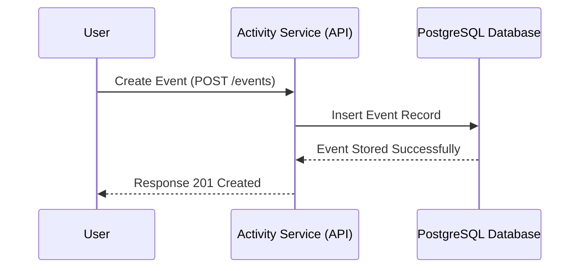

```mermaid
sequenceDiagram
    participant User
    participant API as Activity Service (API)
    participant DB as PostgreSQL Database

    User->>API: Create Event (POST /events)
    API->>DB: Insert Event Record
    DB-->>API: Event Stored Successfully
    API-->>User: Response 201 Created

```