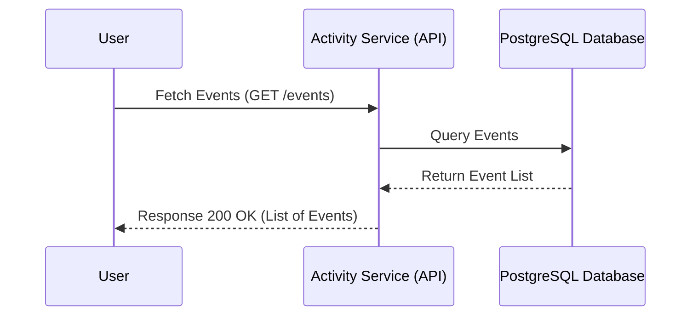

```mermaid
sequenceDiagram
    participant User
    participant API as Activity Service (API)
    participant DB as PostgreSQL Database

    User->>API: Fetch Events (GET /events)
    API->>DB: Query Events
    DB-->>API: Return Event List
    API-->>User: Response 200 OK (List of Events)

```