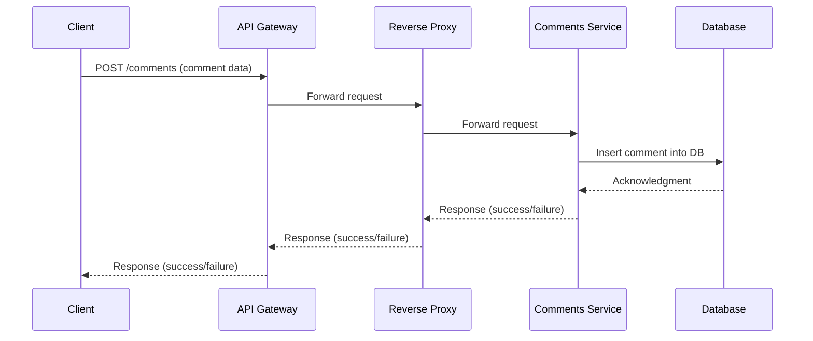

```mermaid
sequenceDiagram
    participant Client
    participant API Gateway
    participant Reverse Proxy
    participant Comments Service
    participant Database

    Client->>API Gateway: POST /comments (comment data)
    API Gateway->>Reverse Proxy: Forward request
    Reverse Proxy->>Comments Service: Forward request
    Comments Service->>Database: Insert comment into DB
    Database-->>Comments Service: Acknowledgment
    Comments Service-->>Reverse Proxy: Response (success/failure)
    Reverse Proxy-->>API Gateway: Response (success/failure)
    API Gateway-->>Client: Response (success/failure)

```