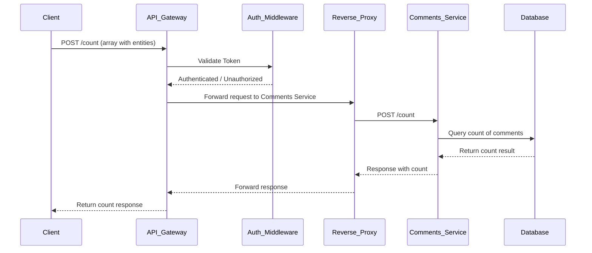

```mermaid
sequenceDiagram
    participant Client
    participant API_Gateway
    participant Auth_Middleware
    participant Reverse_Proxy
    participant Comments_Service
    participant Database

    Client->>API_Gateway: POST /count (array with entities)
    API_Gateway->>Auth_Middleware: Validate Token
    Auth_Middleware-->>API_Gateway: Authenticated / Unauthorized
    API_Gateway->>Reverse_Proxy: Forward request to Comments Service
    Reverse_Proxy->>Comments_Service: POST /count
    Comments_Service->>Database: Query count of comments
    Database-->>Comments_Service: Return count result
    Comments_Service-->>Reverse_Proxy: Response with count
    Reverse_Proxy-->>API_Gateway: Forward response
    API_Gateway-->>Client: Return count response

```