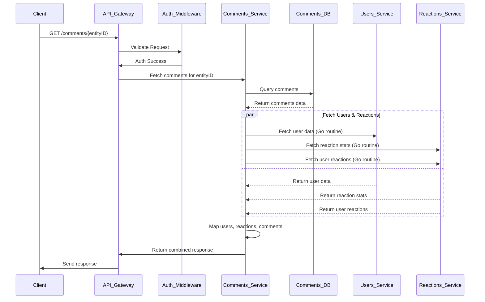

```mermaid
sequenceDiagram
    participant Client
    participant API_Gateway
    participant Auth_Middleware
    participant Comments_Service
    participant Comments_DB
    participant Users_Service
    participant Reactions_Service

    Client->>API_Gateway: GET /comments/{entityID}
    API_Gateway->>Auth_Middleware: Validate Request
    Auth_Middleware->>API_Gateway: Auth Success
    API_Gateway->>Comments_Service: Fetch comments for entityID
    Comments_Service->>Comments_DB: Query comments
    Comments_DB-->>Comments_Service: Return comments data

    par Fetch Users & Reactions
        Comments_Service->>Users_Service: Fetch user data (Go routine)
        Comments_Service->>Reactions_Service: Fetch reaction stats (Go routine)
        Comments_Service->>Reactions_Service: Fetch user reactions (Go routine)
    and
        Users_Service-->>Comments_Service: Return user data
        Reactions_Service-->>Comments_Service: Return reaction stats
        Reactions_Service-->>Comments_Service: Return user reactions
    end

    Comments_Service->>Comments_Service: Map users, reactions, comments
    Comments_Service->>API_Gateway: Return combined response
    API_Gateway->>Client: Send response

```
