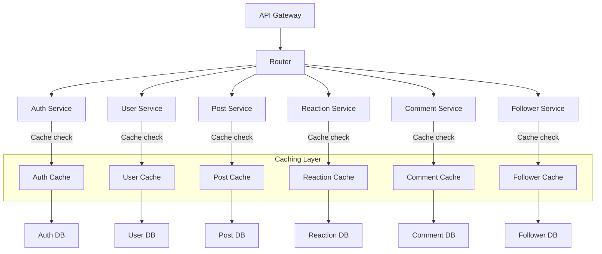

# Software Requirements Specification (SRS)

## 1. Introduction

### 1.1 Purpose

This document describes the software requirements for the social media platform that allows users to register, log in, manage their profiles, interact with posts, reactions, comments, followers, and followees.

### 1.2 Scope

The platform provides functionality for user registration, login, profile management, interaction with posts, adding/removing reactions, comments with replies, and management of followers and followees.

### 1.3 Definitions, Acronyms, and Abbreviations

- **User**: A registered individual on the platform.
- **Post**: Content published by a user.
- **Reaction**: A like or other form of reaction to a post or comment.
- **Comment**: A text-based response to a post or another comment.
- **Follower**: A user who subscribes to another user’s content.
- **Followee**: A user being followed by another user.

---

## 2. System Overview

The system provides the following major functions:

- User registration and authentication
- Profile management (view and update)
- Posts management (create, view, react)
- Comments and replies management
- Followers and followees management
- Reaction handling (like, love, etc.)

## 3. System Architecture

---

## 4. Functional

### 4.1 User Management

- **Registration**: Users can create an account by providing email, password, and username.
- **Login**: Users can log in using their email and password.
- **Profile Management**: Users can view and update their profile (e.g., profile picture, username).
- **Password Management**: Users can reset their passwords.

### 4.2 Post Management

- **Create Post**: Users can create posts with text and optional images.
- **View Post**: Users can view a list of posts by their followers or general feed.
- **Infinite Scroll**: Users can load more posts via infinite scroll.

### 4.3 Reaction Management

- **Add Reaction**: Users can add a reaction (like, love, etc.) to a post or comment.
- **Remove Reaction**: Users can remove their reactions from posts or comments.
- **Count Reactions**: The total number of reactions should be displayed for each post.

### 4.4 Comment Management

- **Add Comment**: Users can add comments to posts.
- **Add Reply**: Users can reply to comments.
- **Infinite Scroll for Comments**: Comments are fetched with infinite scroll functionality.
- **Reactions on Comments**: Users can react to comments in the same way as posts.

### 4.5 Follower/Followee Management

- **Add Follower**: Users can follow other users.
- **Remove Follower**: Users can unfollow other users.
- **Fetch Followers/Followees**: Users can view their followers and followees.

## 5. Non-Functional Requirements

- **Performance**: The system should support handling up to 10,000 concurrent users.
- **Scalability**: The system must be scalable to handle increasing user and data volume.
- **Security**: The system should protect user data and passwords using encryption.
- **Availability**: The platform should have an uptime of 99.9%.

---
