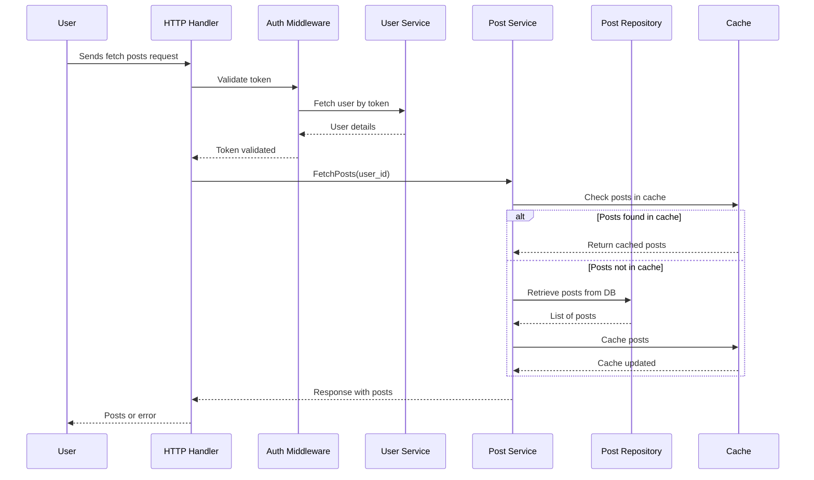

```mermaid
sequenceDiagram
    participant User
    participant HTTPHandler as HTTP Handler
    participant AuthMiddleware as Auth Middleware
    participant UserService as User Service
    participant PostService as Post Service
    participant PostRepository as Post Repository
    participant Cache as Cache

    User ->> HTTPHandler: Sends fetch posts request
    HTTPHandler ->> AuthMiddleware: Validate token
    AuthMiddleware ->> UserService: Fetch user by token
    UserService -->> AuthMiddleware: User details
    AuthMiddleware -->> HTTPHandler: Token validated
    HTTPHandler ->> PostService: FetchPosts(user_id)
    PostService ->> Cache: Check posts in cache
    alt Posts found in cache
        Cache -->> PostService: Return cached posts
    else Posts not in cache
        PostService ->> PostRepository: Retrieve posts from DB
        PostRepository -->> PostService: List of posts
        PostService ->> Cache: Cache posts
        Cache -->> PostService: Cache updated
    end
    PostService -->> HTTPHandler: Response with posts
    HTTPHandler -->> User: Posts or error
```