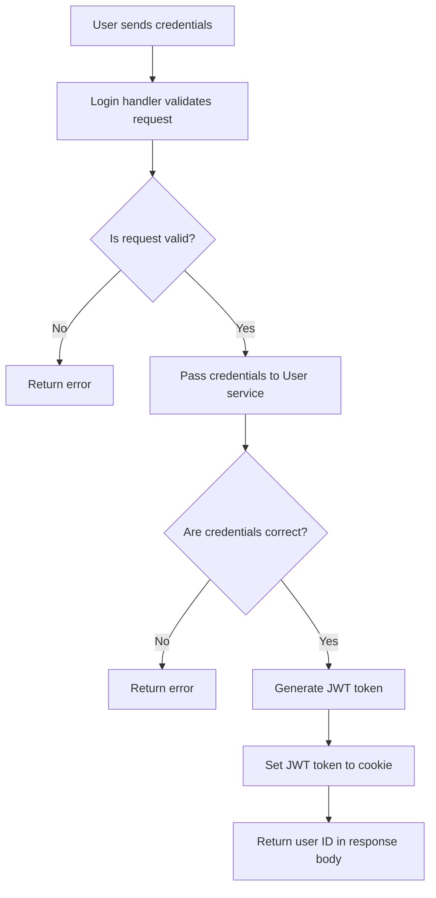

```mermaid
flowchart TD
    A[User sends credentials] --> B[Login handler validates request]
    B --> C{Is request valid?}
    C -->|No| D[Return error]
    C -->|Yes| E[Pass credentials to User service]
    E --> F{Are credentials correct?}
    F -->|No| G[Return error]
    F -->|Yes| H[Generate JWT token]
    H --> I[Set JWT token to cookie]
    I --> J[Return user ID in response body]
```