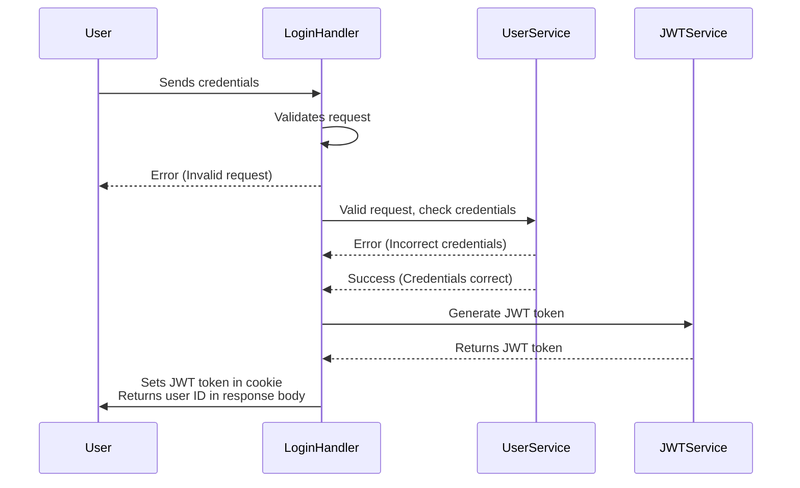

```mermaid
sequenceDiagram
    participant User
    participant LoginHandler
    participant UserService
    participant JWTService

    User->>LoginHandler: Sends credentials
    LoginHandler->>LoginHandler: Validates request
    LoginHandler-->>User: Error (Invalid request)
    LoginHandler->>UserService: Valid request, check credentials
    UserService-->>LoginHandler: Error (Incorrect credentials)
    UserService-->>LoginHandler: Success (Credentials correct)
    LoginHandler->>JWTService: Generate JWT token
    JWTService-->>LoginHandler: Returns JWT token
    LoginHandler->>User: Sets JWT token in cookie<br/>Returns user ID in response body
```