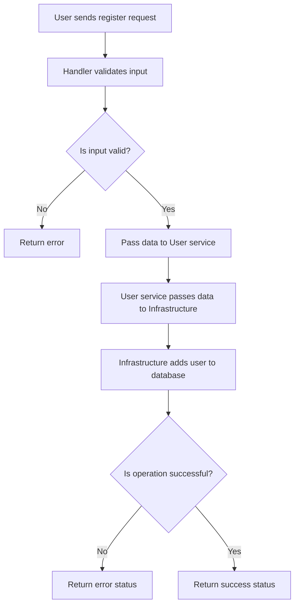

```mermaid
graph TD
  A[User sends register request] --> B[Handler validates input]
  B --> C{Is input valid?}
  C -->|No| D[Return error]
  C -->|Yes| E[Pass data to User service]
  E --> F[User service passes data to Infrastructure]
  F --> G[Infrastructure adds user to database]
  G --> H{Is operation successful?}
  H -->|No| I[Return error status]
  H -->|Yes| J[Return success status]
```