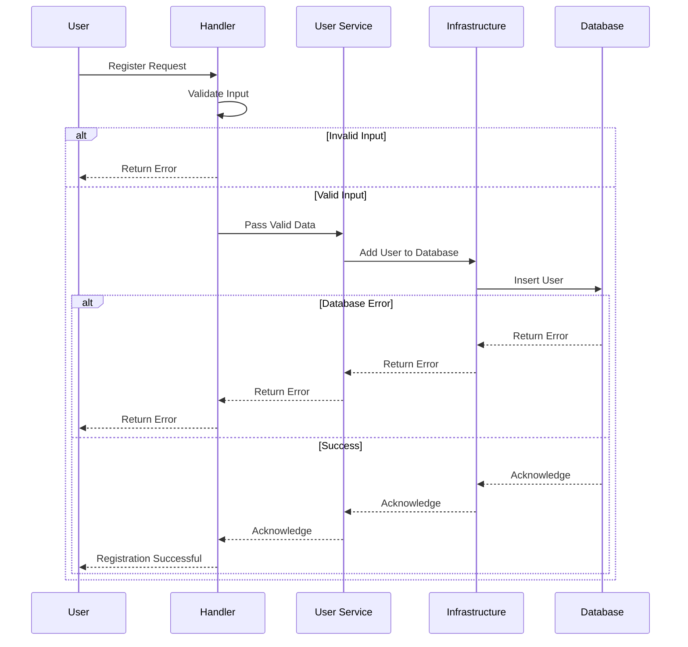

```mermaid
sequenceDiagram
    participant User as User
    participant Handler as Handler
    participant UserService as User Service
    participant Infrastructure as Infrastructure
    participant Database as Database

    User ->> Handler: Register Request
    Handler ->> Handler: Validate Input
    alt Invalid Input
        Handler -->> User: Return Error
    else Valid Input
        Handler ->> UserService: Pass Valid Data
        UserService ->> Infrastructure: Add User to Database
        Infrastructure ->> Database: Insert User
        alt Database Error
            Database -->> Infrastructure: Return Error
            Infrastructure -->> UserService: Return Error
            UserService -->> Handler: Return Error
            Handler -->> User: Return Error
        else Success
            Database -->> Infrastructure: Acknowledge
            Infrastructure -->> UserService: Acknowledge
            UserService -->> Handler: Acknowledge
            Handler -->> User: Registration Successful
        end
    end
```