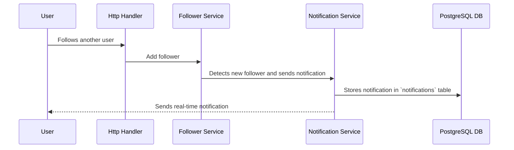

```mermaid
sequenceDiagram
    participant User as User
    participant HttpHandler as Http Handler
    participant FollowerService as Follower Service
    participant NotificationService as Notification Service
    participant Database as PostgreSQL DB

    User->>HttpHandler: Follows another user
    HttpHandler->>FollowerService: Add follower

    FollowerService->>NotificationService: Detects new follower and sends notification
    NotificationService->>Database: Stores notification in `notifications` table
    NotificationService-->>User: Sends real-time notification
```