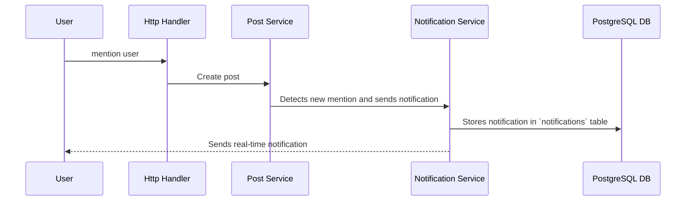

```mermaid
sequenceDiagram
    participant User as User
    participant HttpHandler as Http Handler
    participant PostService as Post Service
    participant NotificationService as Notification Service
    participant Database as PostgreSQL DB

    User->>HttpHandler: mention user
    HttpHandler->>PostService: Create post

    PostService->>NotificationService: Detects new mention and sends notification
    NotificationService->>Database: Stores notification in `notifications` table
    NotificationService-->>User: Sends real-time notification
```