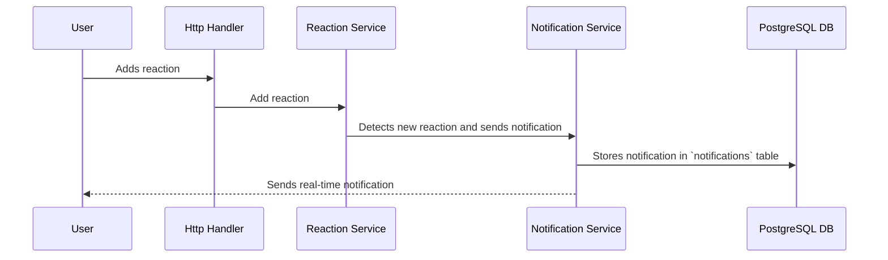

```mermaid
sequenceDiagram
    participant User as User
    participant HttpHandler as Http Handler
    participant ReactionService as Reaction Service
    participant NotificationService as Notification Service
    participant Database as PostgreSQL DB

    User->>HttpHandler: Adds reaction
    HttpHandler->>ReactionService: Add reaction

    ReactionService->>NotificationService: Detects new reaction and sends notification
    NotificationService->>Database: Stores notification in `notifications` table
    NotificationService-->>User: Sends real-time notification
```