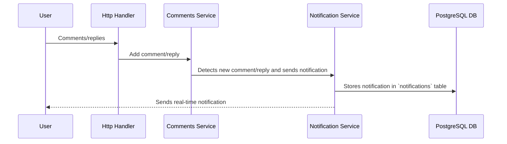

```mermaid
sequenceDiagram
    participant User as User
    participant HttpHandler as Http Handler
    participant CommentsService as Comments Service
    participant NotificationService as Notification Service
    participant Database as PostgreSQL DB

    User->>HttpHandler: Comments/replies
    HttpHandler->>CommentsService: Add comment/reply

    CommentsService->>NotificationService: Detects new comment/reply and sends notification
    NotificationService->>Database: Stores notification in `notifications` table
    NotificationService-->>User: Sends real-time notification
```